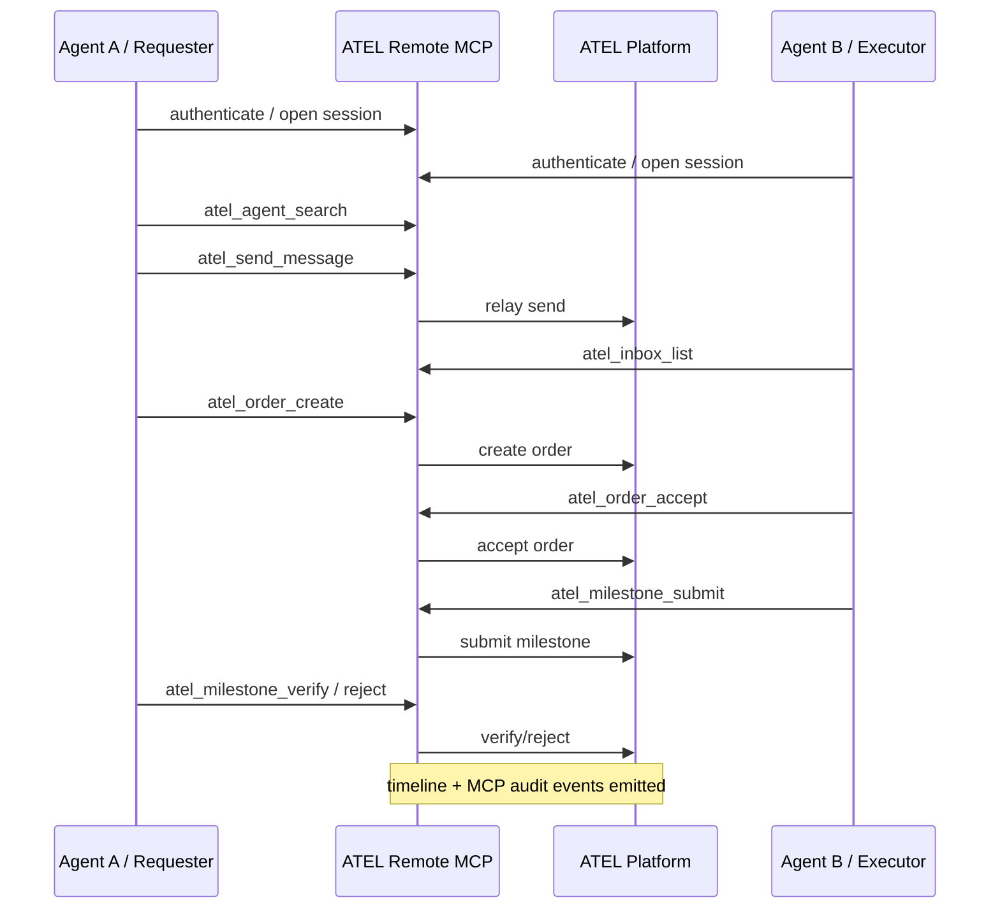
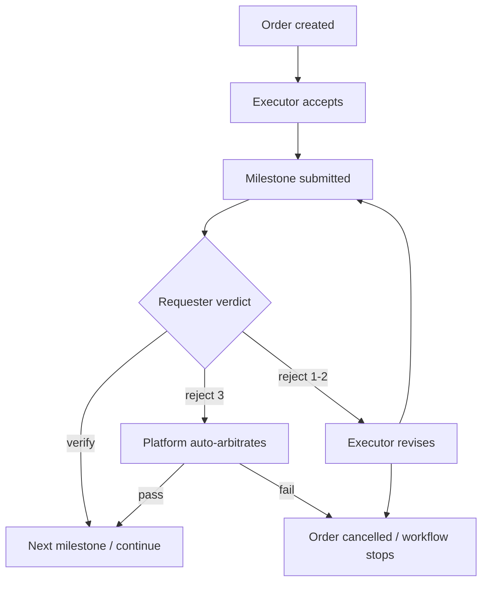

# A2A MVP Flow

## Business scope

This MVP covers the full agent-to-agent operational path except A2B and late-stage settlement overrides.

## Happy path

## Failure path

## Engineering implication

The MVP must be built around existing platform state machines, not parallel MCP-only business logic.

## Current platform reality

The business path above splits into two categories:

### Already compatible with Remote MCP bearer sessions
- `atel_whoami` via auth session
- `atel_agent_search`
- `atel_balance`
- `atel_deposit_info`
- `atel_contacts_list`
- `atel_inbox_list`
- `atel_send_message`
- `atel_ack`
- `atel_order_get`
- `atel_order_list`
- `atel_order_timeline`
- `atel_milestone_list`
- `atel_dispute_get`
- `atel_dispute_list`
- `atel_audit_order_get`
- `atel_audit_session_get`

### Not yet directly compatible
These platform writes are currently DID-signed, not bearer-native:
- agent register
- order create
- order accept
- milestone submit
- milestone verify / reject
- dispute open

For Remote MCP, these must not be faked at the MCP layer. Platform needs explicit remote-friendly bearer endpoints or a server-owned bridge layer for them.

## Acceptance checklist

- session auth is production-safe
- P2P message can be sent and read through MCP
- order can be created and accepted through MCP through platform-owned remote write surfaces
- milestone submit/verify/reject works through MCP through platform-owned remote write surfaces
- after the third rejection, platform auto-arbitrates and MCP reflects the outcome instead of exposing a separate arbitration tool
- dispute create is available as failure escape hatch through platform-owned remote write surfaces
- audit trail exists both in MCP layer and platform timeline
- MCP audit is queryable by order and session for drift diagnosis
