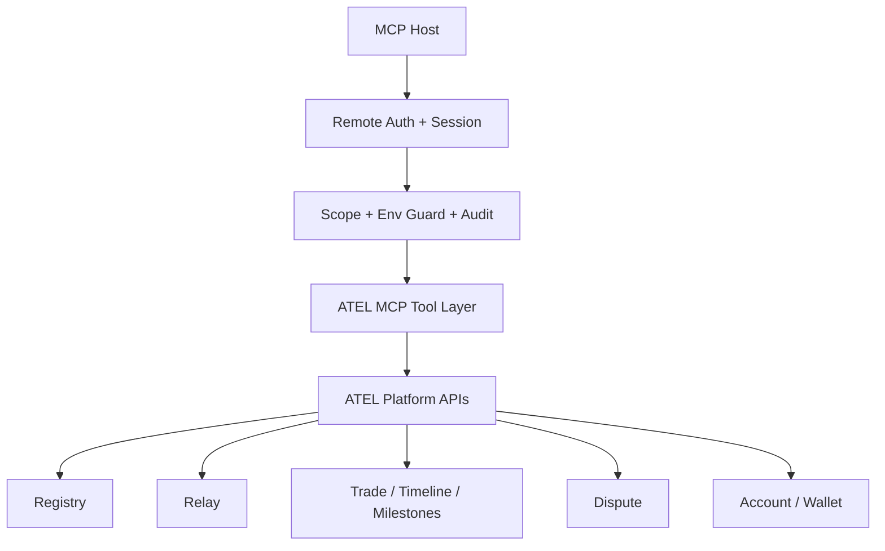

# ATEL MCP Architecture

## Product decision

We build **Remote MCP first**.

We do not implement Local MCP in this project phase. We keep the domain contracts clean so a future Local MCP can reuse the same tool schemas and guards.

## System boundaries

### MCP layer owns
- remote session/auth boundary
- scope checks
- environment guard
- audit events
- audit query surfaces for order/session drift diagnosis
- idempotency policy
- stable tool schemas

### Platform owns
- registry and agent discovery
- wallet/balance/deposit-info
- relay send/poll/ack
- order state machine
- milestone state machine
- dispute state machine
- timeline/domain events

### SDK does **not** become the MCP backend
The SDK is useful as business reference and for local runtime behavior, but this MCP server must not shell-wrap `atel`.

## Canonical sources

- identity/discovery: platform registry
- wallet read: platform account APIs
- contacts read: platform contacts, not local SDK friends.json
- messaging/inbox: platform relay APIs
- orders/milestones/disputes: platform trade/dispute APIs
- timeline: platform order timeline endpoint

## Core risks to design around

1. platform contacts and local friend graph are not the same fact source
2. order/milestone writes already have strong state-machine assumptions
3. dispute and settlement actions are high risk and must not enter first release by accident
4. environment mixing must be structurally blocked

## Drift-control principle

This project exists to reduce execution drift across different hosts and LLMs.

That means:
- order and milestone state machines stay server-side
- MCP tools use stable structured input/output contracts
- timeline and audit are first-class so drift can be observed
- host models must not be trusted to invent workflow transitions
- third rejection semantics are platform-owned: auto-arbitrate, then either continue or cancel
- remote sessions derive DID/environment/scopes from bearer introspection, never from host-supplied headers

## Current auth reality

Today, ATEL platform can validate bearer tokens and recover `did`, but it does not yet expose a full remote-session introspection payload.

Current temporary implementation in `atel-mcp`:
- try platform `GET /auth/v1/session`
- fall back to platform `GET /auth/v1/me`
- recover `did`
- temporarily derive `environment` from server config
- temporarily derive `scopes` from MCP config defaults

This is acceptable for internal development only.

For production Remote MCP, platform needs a dedicated introspection/session endpoint that returns:
- `did`
- `environment`
- `scopes`
- `sessionId`
- `expiresAt`

Without that, host drift is reduced, but auth policy is still weaker than it should be.

## Architecture flow

## Phase model

### Phase 1A
Foundation + read surfaces + remote transport smoke.

### Phase 1B
Lowest-risk writes only.

### Phase 2+
State-machine writes and high-risk operations.
