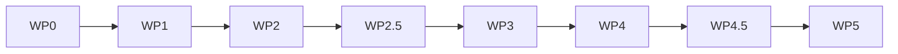

# Engineering Work Packages

## Team structure

### Role A — Architecture / Protocol lead
Owns:
- product boundary
- tool inventory
- phase cut
- scope matrix
- error model
- audit model

### Role B — MCP Infra engineer
Owns:
- TypeScript project shell
- transport lifecycle
- auth/session abstraction
- tool registration pattern
- config loading

### Role C — Platform integration engineer
Owns:
- platform HTTP client
- typed adapters for registry/account/relay/trade/dispute
- upstream error normalization

### Role D — MCP application engineer
Owns:
- identity tools
- wallet read tools
- contacts/inbox tools
- order read tools
- lowest-risk write tools

### Role E — QA / integration engineer
Owns:
- phase acceptance matrix
- host smoke tests
- schema regression
- environment guard regression

## Work package split

### WP0 — Domain freeze
Owner: Role A
Deliverables:
- phase map
- tool inventory
- scope matrix
- environment policy
- audit event fields

### WP1 — Project shell
Owner: Role B
Deliverables:
- package scaffold
- tsconfig
- docs skeleton
- contracts module
- placeholder runtime entry

### WP2 — Platform adapter layer
Owner: Role C
Deliverables:
- registry client
- account client
- relay client
- trade client
- dispute client
- normalized error translation

### WP2.5 — Platform remote-write surfaces
Owner: Role C + Role A
Deliverables:
- remote session/introspection endpoint
- bearer-native agent register surface
- bearer-native order state-machine write surfaces
- bearer-native dispute-open surface
- no public milestone arbitration tool in MVP; consume platform-owned auto-arbitration outcome instead
- clear separation between DID-signed public protocol endpoints and Remote MCP server-owned endpoints

### WP3 — Phase 1A tools
Owner: Role D
Deliverables:
- whoami/search
- balance/deposit-info
- contacts list
- inbox list
- order get/list/timeline
- milestone list
- dispute get/list

### WP4 — Phase 1B tools
Owner: Role D
Deliverables:
- send_message
- ack
- direct-compatible remote tools only

### WP4.5 — Phase 1C remote state-machine tools
Owner: Role D + Role C
Deliverables:
- agent register
- order_create
- order_accept
- milestone_submit
- milestone_verify
- milestone_reject
- dispute_create

Constraint:
- these only ship after WP2.5 exists

### WP5 — Guardrails and QA
Owner: Role E
Deliverables:
- scope check coverage
- audit coverage
- env mismatch tests
- upstream error snapshot tests
- host smoke scripts

## Delivery sequence

